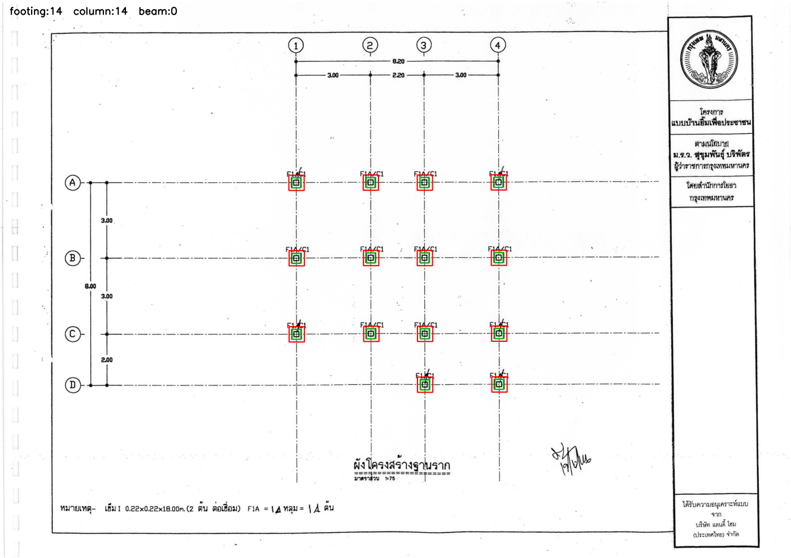
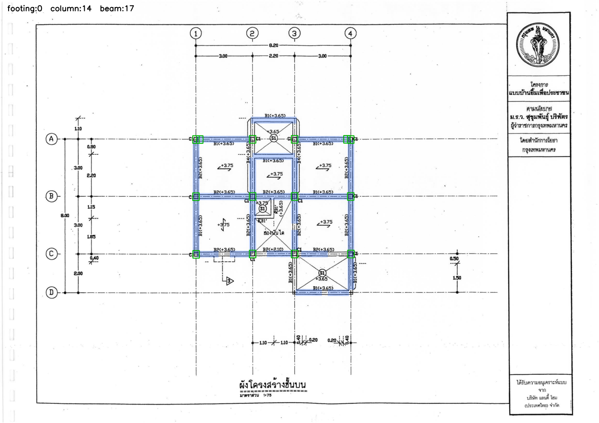
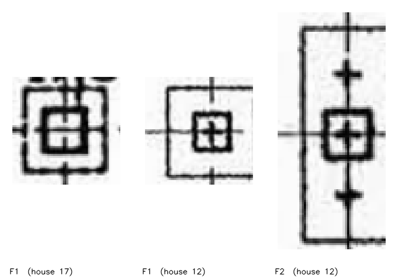
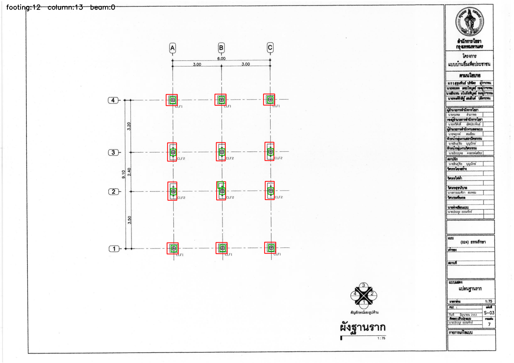

# ตอนที่ 4 — วันที่เราเลิกพึ่ง AI อย่างเดียว (25 สิงหาคม 2569)

ต่อจาก `2026-08-21(teach mk).md` (ตอนที่ 3)
คำศัพท์พื้นฐาน (token, LoRA, VRAM, visual token, grammar-constrained decoding) อธิบายไว้ในตอนที่ 1-3 แล้ว ตรงนี้จะอ้างถึงเฉยๆ

> **สรุปสั้นที่สุดก่อนอ่านยาว:** วันนี้มะขามประชุมกับอาจารย์ได้มา 4 ข้อ ผมไปหาข้อมูลทั้ง 4 ข้อ
> พบว่า **2 ข้อใช้ไม่ได้กับงานเรา** (ข้อ 3 กับ 4 — เหตุผลอยู่ในบทที่ 2) และ **1 ข้อทำได้จริงเลย**
> คือ **pattern recognition** เราจึงสร้างเครื่องมือใหม่ชื่อ `tools/pattern_recognition.py` ที่
> **มาร์คตำแหน่ง เสา/คาน/ฐานราก ลงบนภาพแบบก่อสร้างโดยไม่ใช้ AI เลย** — ใช้คณิตศาสตร์ล้วนๆ
> ทดสอบแล้วได้ฐานราก 14/14 และ 12/12 ในสองบ้าน
>
> **ประเด็นสำคัญที่สุดของวันนี้ไม่ใช่เครื่องมือ แต่เป็นแนวคิด:** ที่ผ่านมาเราแก้ปัญหาทุกอย่าง
> ด้วยการ "ทำให้ AI เก่งขึ้น" (เทรนเพิ่ม, เปลี่ยนโมเดล, บังคับไวยากรณ์) วันนี้เป็นครั้งแรกที่เรา
> **แก้ด้วยการไม่ใช้ AI** ในส่วนที่ AI ไม่จำเป็นต้องทำ

---

## 1. ย้อนดูก่อน — ปัญหาที่ยังแก้ไม่ตกจากคืนก่อน

### 1.1 t03 เทรนเสร็จแล้ว แต่ยังไม่ชนะ

เมื่อคืน (24-25 ส.ค.) เราเทรนโมเดลรอบที่ 3 เสร็จ ผลออกมาแบบนี้:

| งาน (subtask) | t02 (รอบก่อน) | t03 (รอบล่าสุด) |
|---|---|---|
| schedule (ตารางเหล็ก) | 0% | **21.9%** ✅ ดีขึ้น |
| plan_slab (ผังพื้น) | 0% | **20%** ✅ ดีขึ้น |
| plan_footing (ผังฐานราก) | 33.3% | 33.3% เท่าเดิม |
| section (รูปตัด) | 0% | 0% เท่าเดิม |
| **plan_beam (ผังคาน)** | **0%** | **0%** ❌ **ไม่ขยับเลย** |

บรรทัดสุดท้ายคือปัญหา เพราะ **ผังคานคือเป้าหมายหลักของทั้งรอบ** เราเทรนใหม่ทั้งรอบ
เสียเงินไป ~$5 เสียเวลา 5 ชั่วโมง เพื่อจะพบว่าเรื่องที่ตั้งใจแก้ที่สุด ไม่ขยับเลยแม้แต่นิดเดียว

### 1.2 "element recall" คืออะไร — คำที่ต้องเข้าใจก่อนอ่านต่อ

คำนี้จะโผล่ทั้งเอกสาร ต้องเข้าใจก่อน

สมมติหน้าแปลนคานหน้าหนึ่ง **มีคานจริง 15 ตัว** (นี่คือ "เฉลย" ที่คนนั่งอ่านแบบแล้วจดไว้)
เราให้ AI อ่านหน้าเดียวกัน AI ตอบมา 3 ตัว และถูกจริงแค่ 2 ตัว

- **recall (การเรียกคืน)** = ของจริงที่หาเจอ ÷ ของจริงทั้งหมด = 2 ÷ 15 = **13%**
- แปลไทยตรงๆ ว่า "**เจอกี่เปอร์เซ็นต์ของที่ควรเจอ**"

**recall 0% แปลว่า AI หาไม่เจอเลยสักตัว** — ไม่ใช่หาเจอแต่อ่านค่าผิด แต่คือ**ไม่เห็นมันเลย**

### 1.3 ทำไมมันถึงแย่ขนาดนั้น

พอไปดูของจริงที่ AI ตอบ พบว่าในหน้าแปลนคานที่ยาก มันเขียนแบบนี้:

```json
{
  "png": "20",
  "sheet_code": "S-03",
  "elements": []          ← ว่างเปล่า
}
```

**มันเขียนแค่ข้อมูลหัวกระดาษ แล้วปิดไฟล์เลย โดยไม่ใส่คานสักตัว** — และที่แย่กว่านั้น
ข้อมูลหัวกระดาษที่มันเขียนยังชี้ผิดบ้านด้วยซ้ำ (บอกว่าเป็นบ้าน 22 ทั้งที่กำลังอ่านบ้าน 08)
เหมือนมัน**จำแบบฟอร์มจากตัวอย่างที่เคยเห็นมาแปะ** โดยไม่ได้ดูภาพตรงหน้าจริงๆ

นี่ไม่ใช่ปัญหา "อ่านตัวเลขพลาด" แต่เป็นปัญหา "**มองไม่เห็นว่ามีของอยู่ตรงนั้น**"
— และนี่คือเบาะแสสำคัญที่นำไปสู่งานวันนี้

---

## 2. ประชุมกับอาจารย์ — 4 ข้อ และคำตอบของแต่ละข้อ

มะขามกลับมาพร้อม 4 หัวข้อ ผมไปหาข้อมูลทั้งหมดแล้ว ขอตอบทีละข้อแบบตรงไปตรงมา
**2 ข้อใช้ได้ 2 ข้อใช้ไม่ได้** — และการรู้ว่าอะไร**ใช้ไม่ได้**ก็มีค่าพอๆ กัน เพราะประหยัดเงินและเวลา

### 2.1 ข้อ 1 — "ทำ dictionary แปลไทยเป็นอังกฤษ" → **มีของจริงรองรับ แต่ต้องทำให้ถูกวิธี**

**อาจารย์เห็นอะไร:** คำสั่ง (prompt) ที่เราเขียนให้ AI เป็นภาษาอังกฤษหมด แต่ตัวแบบก่อสร้าง
เป็นภาษาไทยหมด อาจารย์สงสัยว่าตรงรอยต่อนี้จะทำให้ AI สับสนไหม

**สิ่งที่ผมไปเจอ:** มีเทคนิคที่มีชื่อทางวิชาการจริง เรียกว่า **DIP (Dictionary Insertion
Prompting)** — งานวิจัยปี 2024 วิธีคือ **แทรกคำแปลสั้นๆ ของศัพท์สำคัญเข้าไปในคำสั่ง** เช่น

```
คำศัพท์ที่จะเจอบนแบบ:
  เสา = column,  คาน = beam,  ฐานราก = footing
  เหล็กปลอก / ป. = stirrup,  ตอม่อ = pedestal
```

ไม่ใช่การแปลข้อความบนแบบ แต่เป็นการ**ใส่พจนานุกรมย่อไว้ข้างๆ** ให้ AI เปิดดูได้

**คำเตือนสำคัญที่เจอจากอีกงานวิจัย:** ถ้า**แปลคำสั่งทั้งชุด**เป็นอังกฤษ ความแม่นยำอาจ
**ลดลง ~8%** เพราะภาษาต้นทางมีบริบทที่คำแปลทำหาย → ดังนั้นต้องทำแบบ "แทรกศัพท์"
ไม่ใช่ "แปลทั้งหมด"

**สถานะ:** ยังไม่ได้ทำ รอถามอาจารย์ว่าอยากแก้ปัญหาข้อไหนกันแน่

---

### 2.2 ข้อ 2 — "เอา pattern recognition มาใช้ (cv2 template matching)" → **✅ ทำแล้ววันนี้**

อันนี้คือเนื้อหาหลักของเอกสารนี้ ข้ามไปอ่านบทที่ 3 ได้เลย

---

### 2.3 ข้อ 3 — "max_frames 768 อยากเพิ่ม" → **❌ เพิ่มไปก็ไม่มีผลอะไรเลย**

อันนี้ต้องอธิบายละเอียดหน่อย เพราะเป็นกรณีศึกษาที่ดีมาก

**เลข 768 มีอยู่จริง** ผมไปหาเจอในไฟล์ `processor_config.json` ของ t03:

```json
"video_processor": {          ← สังเกตคำนี้ให้ดี
    "max_frames": 768,
    "fps": 2
}
```

**แต่คำว่า `video_processor` คือกุญแจ** — `max_frames` แปลว่า "จำนวนเฟรมสูงสุด**ของวิดีโอ**"
โมเดล Qwen รับได้ทั้งภาพนิ่งและวิดีโอ ถ้าป้อนวิดีโอเข้าไป มันจะตัดวิดีโอเป็นภาพนิ่งทีละเฟรม
และตัดได้มากสุด 768 เฟรม

**แต่เราไม่เคยป้อนวิดีโอเลยสักครั้ง** เราป้อนภาพแบบก่อสร้างทีละหน้า เป็นภาพนิ่งล้วน
โค้ดของเราเขียนไว้ชัดว่า `{"type": "image", ...}` ไม่เคยมี `"video"` โผล่มาเลย

> **เปรียบเทียบให้เห็นภาพ:** เหมือนรถเราวิ่งช้า แล้วมีคนแนะนำให้ "ปรับเกียร์ถอยหลังให้แรงขึ้น"
> — เกียร์ถอยหลังมีอยู่จริงในรถ ปรับได้จริง แต่เราไม่เคยใช้มันเลยตอนขับไปข้างหน้า
> ปรับไปก็เท่านั้น

**แล้วปุ่มที่คุมเรื่องนี้จริงๆ คือปุ่มไหน?** มี 2 ตัว ทั้งคู่อยู่ในไฟล์ `train_t03.py`:

| ตัวแปร | ค่าปัจจุบัน | คุมอะไร |
|---|---|---|
| `MAX_PIXELS` | 5,120 × 1,024 | **ความละเอียดต่อ 1 ภาพ** — ภาพถูกย่อแค่ไหนก่อนให้ AI ดู |
| `MAX_LENGTH` | 32,768 | **ความยาวรวมทั้งหมด** — คำสั่ง + ภาพ + คำตอบ รวมกันได้ยาวแค่ไหน |

`MAX_PIXELS` คือตัวที่รอบ t01 เคยตั้งพลาด (ไปโดนย่อเหลือ 512px = ภาพเบลอมาก) แล้วทำให้
ทั้งรอบวัดผลผิด — บทเรียนข้อ 12 ใน `rule_of_tune.md`

**แล้วเพิ่ม `MAX_LENGTH` ได้ไหม?** ได้ในทางทฤษฎี — โมเดลตัวนี้รับได้ถึง **262,144**
(เราใช้แค่ 32,768 = ใช้ไป 12% ของที่มันทำได้) **แต่ติดที่การ์ดจอ ไม่ได้ติดที่โมเดล**
รอบที่แล้วเราต้องลดขนาด LoRA ลงครึ่งหนึ่งเพื่อให้ 32,768 พอดีการ์ด 95GB แล้วยังเกือบไม่พอ

**สรุปข้อ 3:** เลข 768 ที่อาจารย์เห็นเป็นเลขของฟีเจอร์ที่เราไม่ได้ใช้ ส่วนเลขที่ควรสนใจจริง
คือ `MAX_LENGTH` ซึ่งเพิ่มได้ แต่ต้องเช่าการ์ดใหญ่ขึ้น = จ่ายแพงขึ้น

---

### 2.4 ข้อ 4 — "ใช้ Qwen เพิ่มขนาด B ให้มากๆ" → **❌ เราใช้ตัวใหญ่สุดที่โหลดได้อยู่แล้ว**

**"B" คืออะไร:** ย่อจาก Billion (พันล้าน) = จำนวนพารามิเตอร์ พูดง่ายๆ คือ "ขนาดสมอง"
ยิ่งเยอะยิ่งฉลาด แต่ยิ่งกินการ์ดจอ

**เราใช้อยู่:** `Qwen3.6-35B-A3B` = 35 พันล้าน

**ตระกูล Qwen3.6 มีให้โหลดกี่ขนาด?** ผมไปเช็คมาแล้ว มี**แค่ 2 ตัว**:

| รุ่น | ขนาด | โหลดมาเทรนเองได้ไหม |
|---|---|---|
| Qwen3.6-27B | 27B | ได้ (แต่เล็กกว่าที่เราใช้) |
| **Qwen3.6-35B-A3B** | **35B** | **ได้ ← เราใช้ตัวนี้อยู่** |
| Qwen3.6-Max-Preview | ใหญ่กว่า | **ไม่ได้** — เป็นของปิด ใช้ได้ผ่านเว็บ/API เท่านั้น |

**คือเราอยู่บนยอดสุดแล้ว** ไม่มีตัวใหญ่กว่านี้ให้โหลดในตระกูลนี้

**ถ้าจะข้ามไปตระกูลอื่นที่ใหญ่กว่าจริงๆ?** มี — `Qwen3-VL-235B-A22B` (235 พันล้าน)
แต่ตัวเลขค่าใช้จ่ายเป็นแบบนี้:

| | ที่เราทำอยู่ | ถ้าใช้ 235B |
|---|---|---|
| การ์ดจอที่ต้องใช้ | 1 ใบ (96GB) | **8 ใบ (80GB ต่อใบ)** |
| หน่วยความจำรวมตอนเทรน | ~87GB | **~770GB** |
| ราคาต่อชั่วโมง | ~$1.1 | **หลายเท่าตัว** |
| ความซับซ้อน | รันสคริปต์เดียว | ต้องเขียนใหม่ให้กระจายงานข้าม 8 การ์ด |

**สรุปข้อ 4:** ไม่ใช่ "ปรับตัวเลขให้ใหญ่ขึ้น" แต่คือ "เปลี่ยนสเกลโครงการทั้งหมด"
เป็นการตัดสินใจเรื่องงบ ไม่ใช่เรื่องเทคนิค

---

## 3. Template Matching คืออะไร — สอนตั้งแต่ศูนย์

ตอนนี้เข้าเนื้อหาหลัก อธิบายจากศูนย์ ไม่ต้องมีพื้นฐานอะไรมาก่อน

### 3.1 หลักการ: เกม "จับผิดภาพ" ที่คอมพิวเตอร์เล่นแทนเรา

ลองนึกภาพนี้:

1. คุณตัดกระดาษเป็นช่องเล็กๆ ขนาดเท่ารูปฐานราก 1 อัน เรียกว่า **template (แม่แบบ)**
2. คุณเอาช่องนั้นไปทาบบนแบบก่อสร้างแผ่นใหญ่ ที่มุมซ้ายบนสุดก่อน
3. ให้คะแนนว่า "ตรงนี้เหมือนแม่แบบแค่ไหน" — ได้คะแนน 0 ถึง 1
4. **เลื่อนไปขวา 1 พิกเซล** ให้คะแนนใหม่
5. ทำแบบนี้จนครบทั้งแผ่น ทีละพิกเซล

จบแล้วเราจะได้ "แผนที่คะแนน" ที่บอกว่าทุกตำแหน่งบนแบบเหมือนแม่แบบแค่ไหน
ตรงไหนคะแนนสูง = ตรงนั้นมีของที่เราหา

**คำสั่งที่ทำทั้งหมดนี้มีบรรทัดเดียว:**

```python
คะแนน = cv2.matchTemplate(ภาพใหญ่, แม่แบบ, cv2.TM_CCOEFF_NORMED)
```

`cv2` คือชื่อไลบรารี OpenCV — เป็นเครื่องมือประมวลผลภาพที่ใช้กันทั่วโลกมา 20 ปี ฟรี

### 3.2 ทำไมมันถึงเร็วมาก (และไม่ต้องใช้การ์ดจอ)

แบบ 1 หน้าของเรามีขนาด 3309 × 2339 พิกเซล = **7.7 ล้านตำแหน่ง** ที่ต้องทาบและให้คะแนน
ฟังดูเยอะมาก แต่เครื่องทำเสร็จใน **ไม่ถึง 1 วินาที** บน CPU ธรรมดา

เพราะมันเป็นแค่การคูณ-บวกเลข ไม่มีการ "คิด" อะไรเลย ต่างจาก AI ที่ต้องคำนวณผ่าน
โครงข่ายประสาทหลายพันล้านตัว

> **นี่คือเหตุผลที่เครื่องมือนี้มีค่า:** มันฟรี เร็ว และ**ให้ผลเหมือนเดิมทุกครั้ง**
> รันสิบรอบได้คำตอบเดียวกันเป๊ะ ต่างจาก AI ที่ตอบไม่เหมือนกันสองครั้ง

### 3.3 6 วิธีให้คะแนน — และทำไมเราเลือกวิธีนี้

OpenCV ให้เลือก 6 สูตรในการให้คะแนนความเหมือน:

| สูตร | อ่านผลยังไง |
|---|---|
| `TM_SQDIFF`, `TM_SQDIFF_NORMED` | **ยิ่งน้อยยิ่งเหมือน** (วัดความต่าง) |
| `TM_CCORR`, `TM_CCORR_NORMED` | ยิ่งมากยิ่งเหมือน |
| `TM_CCOEFF`, **`TM_CCOEFF_NORMED`** | ยิ่งมากยิ่งเหมือน ← **เราใช้ตัวนี้** |

**ทำไมเลือก `TM_CCOEFF_NORMED`:**

- คำว่า **`NORMED`** (normalized = ปรับให้เป็นมาตรฐาน) แปลว่าคะแนนอยู่ในช่วง **0 ถึง 1**
  เสมอ ทำให้เราตั้งเกณฑ์ได้ เช่น "เอาเฉพาะที่เกิน 0.6" ถ้าไม่ normalize คะแนนจะเป็นเลข
  อะไรก็ไม่รู้ ตั้งเกณฑ์ไม่ได้
- คำว่า **`CCOEFF`** (correlation coefficient) คือสูตรที่**หักค่าความสว่างเฉลี่ยออกก่อนเทียบ**
  สำคัญมากกับงานเรา เพราะแบบเป็นภาพ**สแกน** บางหน้าสแกนติดเทาๆ บางหน้าขาวจัด
  สูตรนี้จะดูที่ "ลวดลาย" ไม่ใช่ "ความสว่าง" → หน้าที่สแกนเข้มก็ยังจับได้

### 3.4 threshold (เกณฑ์) — ปุ่มที่ต้องหมุนเอง

พอได้แผนที่คะแนนแล้ว เราต้องบอกว่า "คะแนนเท่าไหร่ถึงนับว่าเจอ" นี่คือ **threshold**

- **ตั้งสูงไป (เช่น 0.95)** → เจอน้อย ของจริงหลุดไปเยอะ
- **ตั้งต่ำไป (เช่น 0.3)** → เจอเยอะ แต่จับตัวหนังสือ/ขอบตารางมาด้วย

ค่าที่เราใช้จริง (ได้จากการลองจริง ไม่ใช่เดา):

| ประเภท | เกณฑ์ | เหตุผล |
|---|---|---|
| ฐานราก | 0.60 | รูปทรงชัดเจนมาก ตั้ง 0.5-0.8 ก็ได้ 14/14 เท่ากัน |
| เสา | 0.65 | รูปเล็ก ต้องเข้มกว่าหน่อยไม่งั้นจับมั่ว |
| คาน | 0.70 | เป็นเส้นเรียบๆ คล้ายเส้นอื่นเยอะ ต้องเข้มสุด |

### 3.5 NMS — ปัญหาที่ทุกคนเจอ และวิธีแก้

**ปัญหา:** ถ้าฐานรากอยู่ที่พิกัด (1240, 766) พอเราเลื่อนแม่แบบไปที่ (1241, 766) — เลื่อนไป
แค่ 1 พิกเซล — มันก็ยัง**เหมือนอยู่ดี** คะแนนยังสูง

ผลคือฐานราก 1 อัน ทำให้เกิดจุดคะแนนสูง**เป็นร้อยจุด**กระจุกรอบๆ กัน
ของจริงเรามีฐานราก 14 อัน แต่ระบบรายงาน **235 จุด**

**วิธีแก้ชื่อ NMS (Non-Maximum Suppression)** แปลตรงตัวว่า "การกดทับตัวที่ไม่ใช่ที่สุด"
หลักการง่ายมาก:

1. เรียงทุกจุดจากคะแนนสูงสุดลงมา
2. หยิบจุดคะแนนสูงสุดมาเก็บไว้ = "อันนี้ของจริงแน่"
3. **ลบทุกจุดที่อยู่ใกล้จุดนั้น** (ใกล้กว่าครึ่งหนึ่งของขนาดแม่แบบ) — เพราะมันคือตัวเดียวกัน
4. หยิบตัวถัดไปที่ยังเหลือ วนกลับข้อ 2

**ผลจริงของเรา:** 235 จุด → NMS → **14 จุด** ตรงกับของจริงเป๊ะ

### 3.6 ข้อจำกัดที่ต้องรู้ตั้งแต่แรก

จากงานวิจัยที่ผมไปอ่าน (SkeySpot, 2025 — งานตรวจจับสัญลักษณ์บนแบบไฟฟ้า) บอกไว้ชัด:

**Template matching พังเมื่อ:**

1. **สัญลักษณ์หมุน** — ถ้าแม่แบบเป็นแนวตั้งแต่ของจริงเอียง 30 องศา จะจับไม่ได้เลย
2. **สัญลักษณ์ขนาดต่างกัน** — แม่แบบใหญ่ 56px แต่ของจริง 40px ก็ไม่ตรง
3. **สัญลักษณ์วาดคนละแบบ** — คนละสำนักออกแบบวาดไม่เหมือนกัน

**ข้อ 2 และ 3 เราเจอจริงวันนี้ทั้งคู่** (เล่าในบทที่ 5)
งานวิจัยแนะนำให้ใช้ Deep Learning (YOLO) แทน — แต่ YOLO ต้องมีคนนั่ง**วาดกรอบสอน**
เป็นพันภาพก่อน ซึ่งเราไม่มีเวลา template matching จึงเป็นทางที่คุ้มกว่าสำหรับตอนนี้

---

## 4. สิ่งที่สร้างวันนี้ — เดินดูทีละส่วน

### 4.1 หน้าตาของเครื่องมือ

ไฟล์: `tools/pattern_recognition.py`

```
python tools/pattern_recognition.py "image/บ้าน_เล็ก_2ชั้น_17/..._หน้า14.png"
```

ได้ภาพใหม่ออกมาที่ `tools/pattern_out/..._หน้า14_marked.png` หน้าตาแบบนี้:

- **กรอบแดง** = ฐานราก
- **กรอบเขียว** = เสา
- **แถบน้ำเงินโปร่ง** = คาน
- มุมซ้ายบนมีตัวเลขนับให้



*ผังฐานราก บ้าน 17 — ฐานราก 14 อัน (กรอบแดง) ตรงกับของจริงครบ ไม่มีจับมั่วนอกผัง*



*ผังคานชั้นบน บ้าน 17 — แถบน้ำเงินคลุมโครงคาน กรอบเขียวคือเสาที่จุดตัด และไม่มีกรอบแดงเลย (ถูกต้อง เพราะผังคานไม่มีฐานราก)*

### 4.2 แม่แบบมาจากไหน — ตัดจากแบบจริง

แม่แบบ 4 ตัวเก็บไว้ที่ `tools/templates/` ทุกตัว**ตัดมาจากภาพแบบจริง** ไม่ได้วาดขึ้นเอง:

| ไฟล์ | คืออะไร | ตัดมาจาก |
|---|---|---|
| `tpl_footing.png` | ไอคอนฐานราก F1A (สี่เหลี่ยมซ้อน) | บ้าน 17 หน้า 14 |
| `tpl_footing2.png` | ไอคอนฐานราก F2 (ผืนผ้า + จุดเข็ม 2 จุด) | บ้าน 12 หน้า 20 |
| `tpl_footing3.png` | ไอคอนฐานราก F1 ของบ้าน 12 | บ้าน 12 หน้า 20 |
| `tpl_column.png` | กล่องเสา C1 | บ้าน 17 หน้า 16 |

### 4.3 คานพิเศษ — เราไม่ได้ตัดจากภาพ แต่**วาดขึ้นเอง**

คานเป็นข้อยกเว้น เพราะ**คานไม่มีขนาดคงที่** — คานช่วงสั้นยาว 300px คานช่วงยาวยาว 900px
ตัดมาเป็นแม่แบบไม่ได้เพราะไม่รู้จะตัดยาวเท่าไหร่

**ที่คงที่คือ "หน้าตัด" ของมัน** — บนแปลน คานถูกวาดเป็น **เส้นดำ 2 เส้นขนานกัน**
(คือขอบสองข้างของคาน) เราจึงวาดแม่แบบขึ้นเองแบบนี้:

```python
def beam_template(gap=21, thick=3, length=60):
    tpl = ขาวล้วน ขนาด (33 × 60)
    tpl[6:9,   :] = ดำ      # เส้นขอบบนของคาน
    tpl[27:30, :] = ดำ      # เส้นขอบล่างของคาน
    return tpl
```

เลข `gap=21` (ระยะห่าง 21 พิกเซล) **ไม่ได้เดา** — ผมไปวัดจากภาพจริง พบว่าขอบคานบน
อยู่ที่แถว y=758-760 และขอบล่างที่ y=777-779 → ห่างกัน 21 พิกเซล

จากนั้น: หาแม่แบบสั้นๆ นี้ทั่วทั้งหน้า → ได้จุดกระจายเป็นแนวยาว → **ต่อจุดที่ติดกันให้เป็นแถบเดียว**
→ ทิ้งแถบที่สั้นกว่า 100 พิกเซล (กันจับตัวหนังสือ)

> **⚠️ ข้อควรระวังที่บันทึกไว้ในโค้ดแล้ว:** เลข 21 นี้ผูกกับความละเอียดสแกนของชุดนี้
> (3309×2339, มาตราส่วน 1:75) ถ้าเจอบ้านที่สแกนคนละความละเอียด ต้องปรับเอง
> ด้วยตัวเลือก `--beam-gap`

### 4.4 ผลลัพธ์จริง — ตรวจด้วยตาทุกภาพแล้ว

| หน้า | ฐานราก | เสา | คาน | ตรวจแล้วพบว่า |
|---|---|---|---|---|
| บ้าน 17 ผังฐานราก | **14/14** ✅ | 14 | 0 | ไม่จับมั่วสักจุด |
| บ้าน 17 ผังคานชั้นบน | 0 ✅ | 14 | 17 แถบ | แถบน้ำเงินคลุมโครงคานเกือบครบ |
| บ้าน 12 ผังฐานราก | **12/12** ✅ | 13 | 0 | จับได้ทั้ง F1 และ F2 |
| บ้าน 12 ผังคานชั้นสอง | 0 ✅ | 13 | 19 แถบ | — |

สังเกตช่อง "ฐานราก" ในหน้าผังคาน = **0** — นี่คือสิ่งที่ถูกต้อง เพราะผังคานไม่มีฐานราก
ถ้ามันขึ้นเลขอื่นแปลว่าจับมั่ว (และตอนแรกมันจับมั่วจริง — อ่านบทที่ 5)

---

## 5. บั๊ก 2 ตัวที่เจอวันนี้ — และวิธีคิดตอนแก้

ส่วนนี้สำคัญกว่าตัวเครื่องมือ เพราะเป็นวิธีคิดที่ใช้ซ้ำได้กับทุกงาน

### 5.1 บั๊กที่ 1 — F1 กับ F2 ไม่ได้ต่างกันแค่ "ขนาด" แต่ต่างกันที่ "รูปทรง"

**อาการ:** พอลองบ้าน 12 (บ้านที่ 2) ระบบเจอฐานรากแค่ **6 จาก 12**

**สมมติฐานแรกของผม (ผิด):** "คงเป็นเพราะบ้านนี้วาดไอคอนขนาดต่างกัน"
ผมเลยใส่ **multi-scale** เข้าไป คือย่อ/ขยายแม่แบบเป็น 6 ขนาด (0.7, 0.8, 0.9, 1.0, 1.1, 1.2 เท่า)
แล้วหาทุกขนาด

**ผลคือยังได้ 6 เท่าเดิม** → สมมติฐานผิด

**จึงไปเปิดภาพดูจริง** ตัดไอคอนสองอันมาดูข้างๆ กัน แล้วเห็นทันที:

| | F1 | F2 |
|---|---|---|
| รูปทรง | สี่เหลี่ยม**จัตุรัส**ซ้อนกัน | สี่เหลี่ยม**ผืนผ้า**แนวตั้ง |
| ข้างใน | กากบาท 1 อัน | กากบาท 1 อัน + **จุดเข็ม 2 จุด บน-ล่าง** |



*แม่แบบจริงที่ใช้ — ซ้าย/กลางคือ F1 ของสองบ้าน (จัตุรัสซ้อน) ขวาคือ F2 (ผืนผ้า + จุดเข็มบน-ล่าง)*

**มันคือของคนละอย่างกัน ไม่ใช่ของอย่างเดียวกันคนละขนาด** — F1 คือฐานรากเข็ม 1 ต้น
F2 คือฐานรากเข็ม 2 ต้น ต่างกันโดยการออกแบบ ไม่ใช่ต่างกันโดยการวาด

**วิธีแก้: template bank (คลังแม่แบบ)** — แทนที่จะมีแม่แบบเดียว ให้เก็บหลายแบบไว้ในโฟลเดอร์
แล้วหาให้ครบทุกแบบ จากนั้นค่อยเอาผลมารวมกันแล้ว NMS ทีเดียว

```python
def load_templates():
    # อ่านทุกไฟล์ที่ชื่อขึ้นต้นด้วย tpl_footing
    for p in sorted(TEMPLATE_DIR.glob("tpl_footing*.png")):
        ...
```

ข้อดีคือ**ถ้าเจอบ้านที่วาดฐานรากแบบใหม่ แค่ตัดภาพวางเพิ่มในโฟลเดอร์ ไม่ต้องแก้โค้ดเลย**

**ผลหลังแก้: 12/12** ✅



*บ้าน 12 หลังใส่คลังแม่แบบ — จับได้ทั้ง F1 (แถวบน/ล่าง) และ F2 (แถวกลาง) ครบ 12 อัน สังเกตว่ากรอบแดงของ F2 สูงกว่า เพราะไอคอนคนละรูปทรง*

> **บทเรียน:** สมมติฐานแรกที่ฟังดูสมเหตุสมผล (ขนาดต่างกัน) อาจผิดได้
> วิธีพิสูจน์ที่ถูกคือ**เปิดของจริงมาดูด้วยตา** ไม่ใช่เดาต่อแล้วเขียนโค้ดเพิ่ม
> — นี่คือบทเรียนเดียวกับข้อ 14 ใน `rule_of_tune.md`

### 5.2 บั๊กที่ 2 — ฐานรากโผล่ในผังคาน ทั้งที่ผังคานไม่มีฐานราก

**อาการ:** พอเอาแม่แบบ F2 (ผืนผ้าแนวตั้ง) ไปใช้ ปรากฏว่าใน**ผังคาน**ของบ้าน 12
มันขึ้นกรอบแดง 3 อัน — ทั้งที่ผังคานไม่มีฐานรากอยู่แล้ว

**สาเหตุ:** ลองนึกภาพ **คานแนวตั้งวิ่งผ่านกล่องเสา** — มันได้รูปเป็น "สี่เหลี่ยมผืนผ้าแนวตั้ง
ที่มีอะไรอยู่ตรงกลาง" ซึ่ง**หน้าตาเหมือน F2 มาก** คอมพิวเตอร์เห็นแค่รูปทรง มันแยกไม่ออก

**วิธีแก้ที่คิดไว้ตอนแรก (ไม่ดี):** เพิ่ม threshold ให้เข้มขึ้น
→ แต่จะทำให้ F2 จริงในผังฐานรากหลุดไปด้วย = ย้ายปัญหา ไม่ได้แก้

**วิธีแก้ที่ใช้จริง — ใช้ความรู้เรื่องแบบก่อสร้างมาช่วย:**

> **ในผังฐานรากจริง ไม่มีคานให้ตรวจเจอเลย** (เพราะเป็นผังคนละชั้นกัน)
> ดังนั้น: **ถ้าจุดที่คิดว่าเป็นฐานราก ดันอยู่ในแถบคานที่ตรวจเจอ → ตัดทิ้ง**

```python
# ตัดฐานรากที่จุดกึ่งกลางตกอยู่ในแถบคาน
out["footing"] = [f for f in out["footing"]
                  if not any(อยู่ในแถบคาน(f, แถบ) for แถบ in beams)]
```

**ทำไมกฎนี้ปลอดภัย 100%:** เพราะในผังฐานรากจริง ระบบตรวจเจอคาน = 0 แถบ
กฎนี้จึงไม่มีทางไปตัดฐานรากจริงทิ้งได้เลย (ไม่มีแถบให้ตกลงไป)

**ผลหลังแก้: ผังคานได้ฐานราก 0** ✅ และ **ผังฐานรากยังได้ 12/12 เท่าเดิม** ✅

> **บทเรียน:** บางครั้งวิธีแก้ที่ดีที่สุดไม่ใช่การจูนตัวเลข แต่คือการ**ใส่ความรู้เรื่องงานจริง**
> เข้าไปเป็นกฎ — ความรู้ที่ว่า "ผังฐานรากไม่มีคาน" เป็นความรู้ของวิศวกร ไม่ใช่ของโปรแกรมเมอร์

---

## 6. แล้วเครื่องมือนี้ช่วยเรื่อง recall ยังไง

กลับมาที่ปัญหาตั้งต้น: AI มองไม่เห็นคาน 15 ตัวในหน้าหนึ่ง

### 6.1 สิ่งที่เครื่องมือนี้ทำได้ / ทำไม่ได้

| | template matching | AI (Qwen) |
|---|---|---|
| บอกว่า "ตรงนี้มีเสา" | ✅ ทำได้ | ✅ ทำได้ (แต่พลาดบ่อย) |
| บอกว่า "เสาต้นนี้ชื่อ C1 หรือ C2" | ❌ ทำไม่ได้ | ✅ ทำได้ |
| บอกขนาด/จำนวนเหล็ก | ❌ ทำไม่ได้ | ✅ ทำได้ |
| ให้ผลเหมือนเดิมทุกครั้ง | ✅ ได้ | ❌ ไม่ได้ |
| ราคา | ฟรี | ~$1.1/ชม. |

**สองอย่างนี้ไม่ได้แข่งกัน แต่เติมเต็มกัน** — เครื่องมือนี้เก่งเรื่อง "หาว่ามีอะไรตรงไหน"
AI เก่งเรื่อง "อ่านว่ามันคืออะไร"

### 6.2 ทางที่เอาไปใช้ได้ — 3 ทาง เรียงจากปลอดภัยไปเสี่ยง

**(ก) เป็นตัวช่วยคนตรวจงาน** — ตอนมะขามนั่งแก้ rawjson เปิดภาพที่มาร์คแล้วดูควบคู่
จะเห็นทันทีว่ามีคานตรงไหนที่ยังไม่ได้จด **ไม่แตะระบบอะไรเลย ปลอดภัยที่สุด**

**(ข) เป็นตัวเช็คว่า AI ตกหล่นไหม** — รันเครื่องมือได้ 15 แถบคาน แต่ AI ตอบมา 3 ตัว
→ ระบบเตือนทันทีว่า "หน้านี้น่าจะพลาด" ทำให้เรารู้ว่าต้องยิงซ้ำ **ไม่แตะข้อมูลเทรน ปลอดภัย**

**(ค) ป้อนตำแหน่งให้ AI ดูก่อนอ่าน** — บอก AI ล่วงหน้าว่า "หน้านี้มีคานที่พิกัดเหล่านี้
ไปอ่านชื่อมันมา" ได้ผลแรงที่สุด **แต่เป็นการแก้ที่ข้อมูลเทรน = เข้ากติกา `rule_of_tune`
ข้อ 2 ต้องเตือนและขออนุญาตก่อนเสมอ — วันนี้จึงยังไม่ทำ**

---

## 7. สิ่งที่ยังไม่รู้ / ยังไม่ได้ทำ (ต้องพูดตรงๆ)

ตามกติกาของโปรเจกต์นี้ ต้องบอกให้ครบว่าอะไรที่**ยังไม่ได้พิสูจน์**:

1. **ทดสอบแค่ 2 บ้าน และเป็นซีรีส์เดียวกัน** (แบบบ้านยิ้มเพื่อประชาชน ของ กทม.)
   บ้านจากสำนักงานออกแบบอื่นอาจวาดสัญลักษณ์ไม่เหมือนเลย **ยังไม่รู้ว่าจะพังหรือไม่**

2. **ยังไม่เคยลองกับหน้าที่ไม่ใช่ผังโครงสร้าง** — หน้าปก, รูปตัด, ตาราง BOQ
   ถ้ามันไปมาร์คมั่วบนหน้าพวกนี้ คนที่เอาไปใช้จะโดนหลอก **อันนี้ควรทดสอบก่อนใช้จริง**

3. **มีจุดซ้ำเล็กน้อย** — บ้าน 12 ผังฐานรากขึ้นเสา 13 อัน ทั้งที่มี 12 (มีกรอบซ้อนกัน 1 จุด)
   ไม่ได้แก้ เพราะกระทบภาพรวมน้อย

4. **ยังไม่ได้ทำพื้น (S1)** — มะขามสั่งขอบเขตแค่ เสา/คาน/ฐานราก จึงหยุดตามนั้น

5. **ยังไม่ได้เอาไปเชื่อมกับอะไรทั้งสิ้น** — เป็นเครื่องมือเดี่ยวๆ ที่ออกภาพอย่างเดียว
   ไม่แตะ rawjson ไม่แตะ prompt ไม่แตะข้อมูลเทรน

---

## 8. คำศัพท์วันนี้

| คำ | แปลง่ายๆ |
|---|---|
| **template** | แม่แบบ — ภาพเล็กที่เราเอาไปทาบหา |
| **template matching** | การเลื่อนแม่แบบทาบทั่วภาพใหญ่แล้วให้คะแนนความเหมือน |
| **threshold** | เกณฑ์ — คะแนนขั้นต่ำที่จะนับว่า "เจอ" |
| **NMS** | การลบจุดที่ซ้อนกัน ให้เหลือตัวแทน 1 จุดต่อ 1 ของ |
| **multi-scale** | หาหลายขนาด — ย่อ/ขยายแม่แบบแล้วหาทุกขนาด |
| **false positive** | จับมั่ว — บอกว่าเจอ ทั้งที่ไม่มีของอยู่ตรงนั้น |
| **recall** | เจอกี่ % ของที่ควรเจอ |
| **CPU / GPU** | ซีพียู = สมองคอมทั่วไป (งานนี้ใช้แค่นี้) / จีพียู = การ์ดจอ (ต้องเช่า, แพง) |
| **B (ในชื่อโมเดล)** | พันล้านพารามิเตอร์ = ขนาดสมองของ AI |
| **max_frames** | จำนวนเฟรมสูงสุดของ**วิดีโอ** (เราไม่ใช้) |
| **MAX_LENGTH** | ความยาวรวมที่ AI รับได้ต่อครั้ง (อันนี้เราใช้จริง) |

---

## 9. ลองเองได้เลย — คำสั่งทั้งหมด

เปิด terminal ที่โฟลเดอร์ `Training` แล้วพิมพ์:

```bash
# 1. ทดสอบว่าเครื่องมือทำงานถูก (จะเช็คว่าได้ฐานราก 14 อันจริงไหม)
python tools/pattern_recognition.py --demo

# 2. รันกับหน้าไหนก็ได้
python tools/pattern_recognition.py "image/บ้าน_เล็ก_2ชั้น_17/บ้าน_เล็ก_2ชั้น_17_หน้า14.png"

# 3. ถ้าเจอบ้านที่สแกนคนละความละเอียด แล้วคานจับไม่ได้ ลองปรับระยะห่างขอบคาน
python tools/pattern_recognition.py "ภาพ.png" --beam-gap 30
```

ภาพผลลัพธ์อยู่ที่ **`tools/pattern_out/`** เปิดดูได้เลย

**ถ้าเจอบ้านที่วาดฐานรากคนละแบบ** วิธีเพิ่มแม่แบบเอง:

1. เปิดภาพ ครอปเฉพาะไอคอนฐานรากมา 1 อัน (เผื่อขอบนิดหน่อย)
2. เซฟเป็น `tools/templates/tpl_footing4.png` (เลขต่อจากที่มีอยู่)
3. รันใหม่ — โปรแกรมจะอ่านไฟล์ใหม่เองอัตโนมัติ ไม่ต้องแก้โค้ด

---

## 10. สรุปแบบสั้นที่สุด

1. **t03 ดีขึ้นหลายเรื่อง แต่ผังคานยัง 0%** — ปัญหาคือ AI มองไม่เห็นของ ไม่ใช่อ่านผิด
2. **จาก 4 ข้อของอาจารย์: ข้อ 3 (max_frames) และข้อ 4 (เพิ่มขนาด B) ใช้ไม่ได้**
   ข้อ 3 เป็นค่าของฟีเจอร์วิดีโอที่เราไม่ใช้ ข้อ 4 เราอยู่บนตัวใหญ่สุดที่โหลดได้แล้ว
3. **ข้อ 1 (dictionary) มีงานวิจัยรองรับจริง** แต่ต้องทำแบบ "แทรกศัพท์" ไม่ใช่ "แปลทั้งชุด"
4. **ข้อ 2 (pattern recognition) ทำเสร็จแล้ววันนี้** — มาร์ค เสา/คาน/ฐานราก ได้จริง
   ฟรี เร็ว ไม่ใช้การ์ดจอ ไม่ใช้ AI
5. **แนวคิดใหม่ที่ได้:** ไม่ใช่ทุกปัญหาต้องแก้ด้วยการทำให้ AI เก่งขึ้น
   บางอย่างคณิตศาสตร์ธรรมดาทำได้ดีกว่า ถูกกว่า และเชื่อถือได้มากกว่า

---

*เอกสารนี้เขียนวันที่ 25 สิงหาคม 2569 — บันทึกการทำงานแบบละเอียดอยู่ที่ `2026-08-25.md`
โค้ดจริงอยู่ที่ `tools/pattern_recognition.py`*
